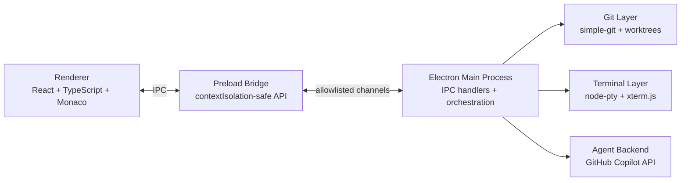
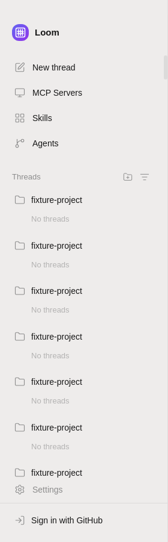
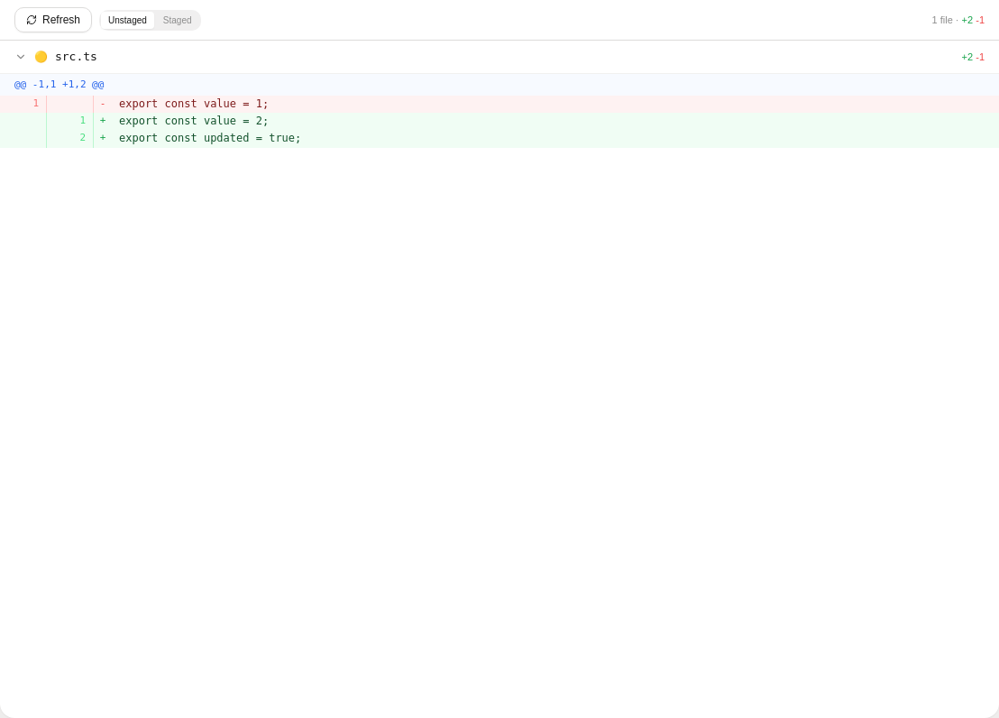
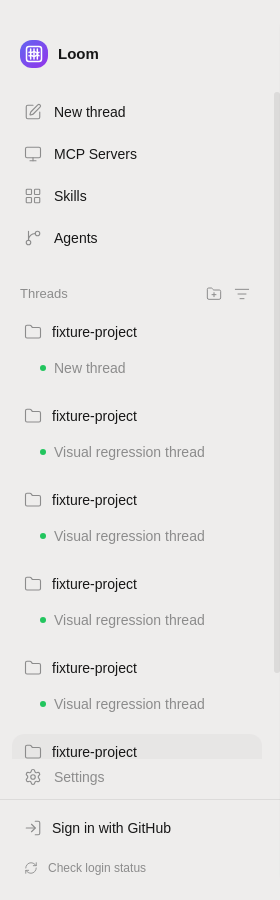
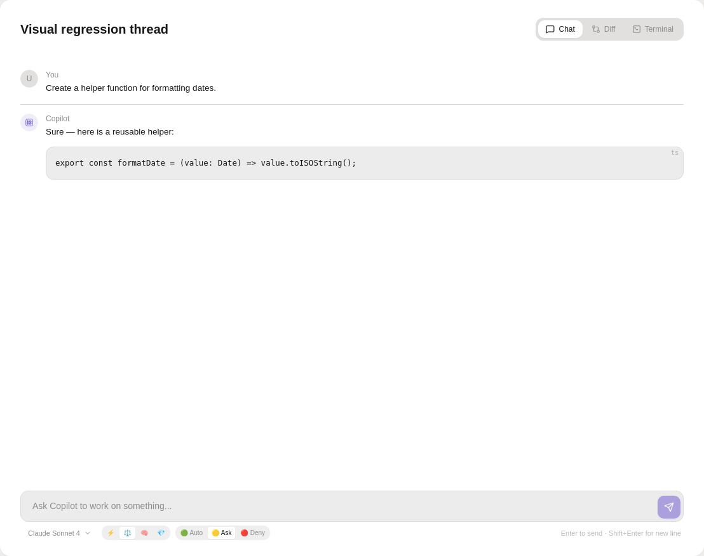
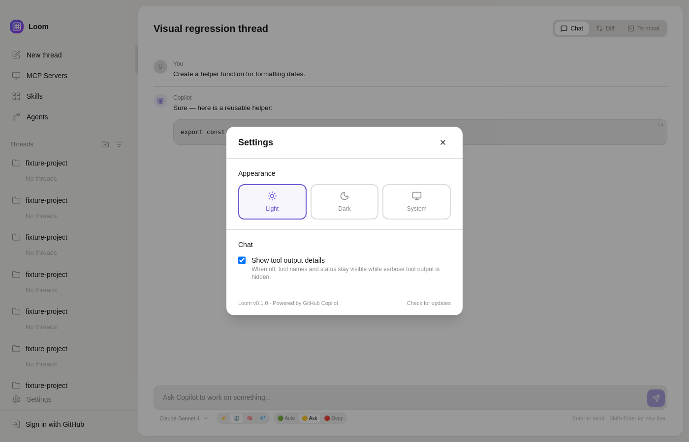
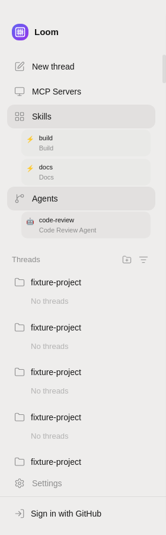
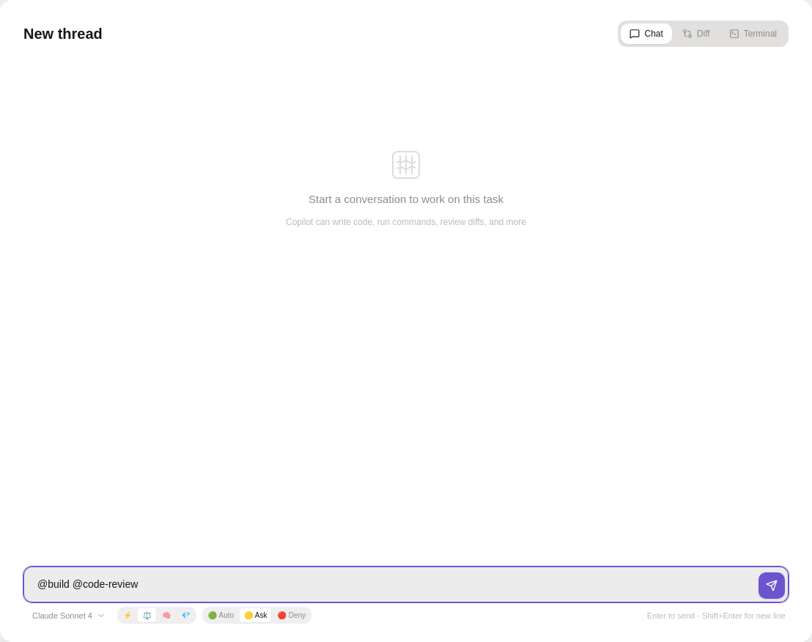

# Loom


> An agentic desktop coding app powered by GitHub Copilot — weaving thread-based multi-agent workflows.

## 🚀 Why Loom

Loom gives you **parallel coding threads**, each with isolated state and worktree context, so multiple agents can run side-by-side without stepping on each other.

- 🧵 **Thread-based workflow** for independent tasks
- 🤖 **Multi-agent orchestration** across worktrees
- 🔒 **Request-scoped streaming isolation** to prevent cross-thread bleed
- 🧠 **Reasoning + tool trace rendering** directly in chat messages
- 🧮 **Per-thread token counter** with prompt/completion/cache breakdown
- 🌑 **Codex-inspired dark UI** with integrated terminal and Git views

## 🏗 Architecture



## 📸 Screenshots

| Sidebar | Thread Panel |
| --- | --- |
|  |  |

| Settings | Diff Viewer |
| --- | --- |
|  |  |

### UI polish before/after (deep review sweep)

| Sidebar (before) | Sidebar (after) |
| --- | --- |
|  |  |

| Thread Panel (before) | Thread Panel (after) |
| --- | --- |
|  |  |

| Settings (before) | Settings (after) |
| --- | --- |
|  |  |

| Diff Viewer (before) | Diff Viewer (after) |
| --- | --- |
|  |  |

### Agent/skill invocation fix

| Skills Sidebar | Thread Invocation |
| --- | --- |
|  |  |

## ✨ Feature Highlights

- 🧵 **Parallel threads** with per-thread chat, terminal, and status
- 🛠️ **Tool-call timeline** with quiet-by-default output details
- 🔄 **Stream-safe responses** with request-level scoping
- 🌲 **Built-in Git workflows** (status, diff, stage, commit, worktrees)
- 🔐 **Permission & input flows** surfaced directly in-thread
- 🧪 **Deterministic test mode** for stable e2e/visual coverage

## 🛡️ Reliability Hardening

- Terminal creation failures (invalid shell/cwd) return structured IPC errors instead of crashing.
- Sidebar async loaders (skills, agents, MCP servers) ignore stale responses after project switches.
- Runtime sessions now load project skills from `.github/copilot/skills` and `.copilot/skills` via `skillDirectories`.
- `@agent ... @skill ...` mentions are forwarded unchanged in prompt text, matching Copilot SDK message semantics.
- Test-only main-process IPC handlers are registered idempotently and guard unavailable windows.
- Agent stream payloads are normalized at IPC boundaries to avoid malformed event crashes across main/renderer.
- Renderer agent error UI now falls back to `Error: Unknown agent error` when providers omit message content.

## 🔄 Deep Review Sweep (Mar 2026)

- ♻️ Code quality: removed dead code, tightened IPC typing, and centralized preload channel constants.
- ✨ UX/UI polish: improved loading/empty states, keyboard/focus behavior, and responsive composition.
- ⚡ Performance: reduced avoidable renderer updates in high-interaction components.
- 🧱 Robustness: strengthened request/event validation and safer terminal error handling.
- 🧪 Testing: expanded unit edge-case coverage and refreshed Electron visual baselines.

## 📦 Installation

### Download (easiest)

Grab the latest `.exe` from [**Releases**](../../releases):

- **Loom Setup.exe** — one-click installer (recommended)
- **Loom-portable.exe** — no install needed, just run

### Prerequisites

- **GitHub Copilot** subscription (Individual, Business, or Enterprise)
- **GitHub CLI** (`gh`) — for authentication ([install](https://cli.github.com))

### Build from source

```bash
git clone https://github.com/Arthur742Ramos/loom.git
cd loom
npm install
npm run package    # builds + creates installer in release/
```

## ▶️ Getting Started

```bash
# Install dependencies
npm install

# Run renderer in development mode
npm run dev

# In another terminal, start Electron
npm start

# Production build
npm run build
npm run package
```

## 🧪 Testing

```bash
# Full CI-equivalent suite (build + unit + e2e + visual)
npm test

# Explicit CI suite
npm run test:ci

# Unit tests
npm run test:unit

# Electron e2e
npm run test:e2e

# Stream isolation regression
npm run test:e2e -- tests/e2e/thread-stream-isolation.spec.ts

# Playwright visual regression
npm run test:visual
```

Visual baselines live in `tests/__screenshots__/electron-visual/`.
Refresh intentionally with:

```bash
xvfb-run -a playwright test tests/visual/ui-regression.spec.ts --project=electron-visual --update-snapshots
```

Descriptive sweep captures are stored in `screenshots/ui-polish-*-before.png` and `screenshots/ui-polish-*-after.png`.

## 🔐 Authentication

Set your GitHub token via one of:
1. Environment variable: `GITHUB_TOKEN`
2. GitHub CLI: `gh auth login`

## 🗂 Project Structure

```text
src/
├── main/           # Electron main process
│   ├── main.ts     # Window lifecycle + IPC setup
│   ├── agent.ts    # Copilot streaming + orchestration
│   ├── git.ts      # Git operations
│   ├── terminal.ts # PTY terminal handling
│   └── preload.ts  # Safe renderer bridge
├── renderer/       # React frontend
│   ├── App.tsx
│   ├── components/
│   ├── store/      # Zustand state
│   └── styles/
└── shared/         # Shared types/contracts
```

## 🧰 Tech Stack

| Component | Technology |
|-----------|-----------|
| Desktop shell | Electron |
| UI framework | React 18 + TypeScript |
| Code editor | Monaco Editor |
| Terminal | xterm.js + node-pty |
| State | Zustand |
| Git | simple-git |
| AI backend | GitHub Copilot API |
| Bundler | Webpack |
