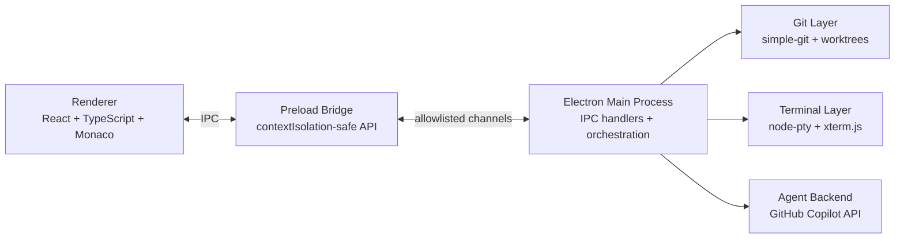

# Loom


> An agentic desktop coding app powered by GitHub Copilot, built for thread-based multi-agent workflows.

## ✨ Key Features

- 🧵 Parallel coding threads with isolated state and worktree context
- 🤖 Multi-agent orchestration across independent threads
- 🔒 Request-scoped streaming isolation for safe concurrency
- 🧠 Reasoning and tool trace rendering directly in chat
- 🧮 Per-thread token accounting for prompt/completion/cache usage
- 🌑 Codex-inspired dark UI with integrated terminal and Git views

## 📸 Screenshots

| Sidebar | Thread Panel |
| --- | --- |
|  |  |

| Settings | Diff Viewer |
| --- | --- |
|  |  |

## 📦 Installation

### Download (recommended)

Get the latest Windows binaries from [Releases](../../releases):

- `Loom Setup.exe` — one-click installer
- `Loom-portable.exe` — portable executable

### Prerequisites

- GitHub Copilot subscription (Individual, Business, or Enterprise)
- GitHub CLI (`gh`) for authentication: <https://cli.github.com>
- Node.js + npm (only required for building/running from source)

### Build from source

```bash
git clone https://github.com/Arthur742Ramos/loom.git
cd loom
npm install
npm run build
```

## 🚀 Quick Start

```bash
gh auth login          # authenticate with GitHub
npm install            # install dependencies
npm run dev            # start webpack watchers
# in another terminal:
npm start              # launch Loom
```

Open a project folder, create a thread, and start prompting agents.

## ▶️ Getting Started

```bash
# Start webpack watchers
npm run dev

# In another terminal, launch Electron
npm start
```

Then authenticate (`gh auth login`), open a local project, create a thread, and start prompting agents.

## 🧭 Usage Overview

1. Open a project folder in Loom.
2. Create one or more threads for parallel tasks.
3. Send prompts in each thread and follow streamed responses.
4. Use built-in terminal and Git panels to inspect, edit, and commit work.
5. Monitor per-thread token usage in the thread header.

## 🏗 Architecture Overview



## 🧪 Testing

Tests are split across three layers: unit, end-to-end, and visual regression.

```bash
npm run test:unit      # Vitest — unit & component tests
npm run test:e2e       # Playwright — Electron end-to-end tests
npm run test:visual    # Playwright — screenshot regression tests
npm run test:ci        # builds, then runs all three suites
```

**Visual regression** tests capture screenshots of key UI panels and compare
them against baselines committed under `tests/__screenshots__/`. A
`maxDiffPixelRatio` of **0.03** (3 %) is applied to each assertion to tolerate
font-rendering differences across CI environments.

To update baselines after an intentional UI change:

```bash
npm run test:visual -- --update-snapshots
```

E2E and visual tests use `LOOM_TEST_MODE` to inject scripted events for
deterministic execution. On headless Linux CI, tests are wrapped with
`xvfb-run`.

## 🤝 Contributing

Contributions are welcome. Open an issue for discussion, then submit a pull request with a clear description and test coverage for behavioral changes.

## 📄 License

This repository currently does not include a `LICENSE` file.
